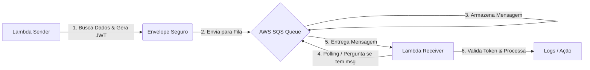

# Projeto de Estudos: Fluxo Assíncrono com Node.js, AWS SQS e Terraform

Este é um projeto prático para aprender Terraform e demonstrar a comunicação entre
**Microserviços** usando uma arquitetura orientada a eventos
(Event-Driven). Simulei um ambiente AWS localmente para criar um fluxo
de envio e recebimento de mensagens seguro.

------------------------------------------------------------------------
## Arquitetura e Fluxo

O sistema funciona como um correio seguro. Um serviço envia uma carta
lacrada, e outro serviço a lê quando possível.




## Tech Stack (Ferramentas)

-   **Node.js & TypeScript**: A linguagem e o motor da lógica.\
-   **Terraform (IaC)**: Para criar a infraestrutura (a Fila SQS) via
    código, sem cliques manuais.\
-   **Localstack (Docker)**: Para simular a AWS dentro do computador sem
    custos.\
-   **AWS SDK v3**: Para conectar o código à infraestrutura.\
-   **JWT (JSON Web Token)**: Para garantir a segurança e integridade
    das mensagens.

------------------------------------------------------------------------

## Estrutura do Projeto

    ├── docker-compose.yml       # O Simulador da AWS (Localstack)
    ├── setup.sh                 # Script de automação (Inicia tudo)
    ├── infra/                   # Onde o Terraform cria a Fila SQS
    └── lambdas/
        ├── servico-envio/       # O Remetente (Gera Token -> Envia SQS)
        └── servico-recebimento/ # O Destinatário (Lê SQS -> Valida -> Loga)

------------------------------------------------------------------------

## Como Rodar o Projeto
### Pré-requisitos

-   Docker Desktop (Deve estar aberto e rodando)
-   Node.js instalado
-   Terraform instalado

### Passo a Passo Automático
Dê permissão ao script:

``` bash
chmod +x setup.sh
```

Execute tudo:

``` bash
./setup.sh
```

### Rodando o fluxo
#### Terminal 1 (Ouvinte)

``` bash
cd lambdas/servico-recebimento
npm start
```

#### Terminal 2 (Remetente)

``` bash
cd lambdas/servico-envio
npm start
```

Cada execução envia uma nova mensagem.

------------------------------------------------------------------------

## Dicionário de Conceitos

  -------------------------------------------------------------------------
  Conceito        Analogia Simples            Explicação Técnica
  --------------- --------------------------- -----------------------------
  **SQS (Queue)** Caixa de correio            Processamento assíncrono e
                                              desacoplado

  **Terraform**   Planta da casa              Infraestrutura como código

  **JWT**         Lacre de cera               Autenticação e integridade
                                              dos dados

  **Polling**     "Já chegou?"                Checagem periódica por novas
                                              mensagens
  -------------------------------------------------------------------------

------------------------------------------------------------------------
## Anotações de estudos

O arquivo anotacoes-estudos.txt é um arquivo de entendimento dos conceitos e explicando o código conforme eu ia aprendendo e entendendo os conceitos. E o coloquei aqui pra ficar mais simples de relembrar conceitos ou estrutura caso possa esquecer.